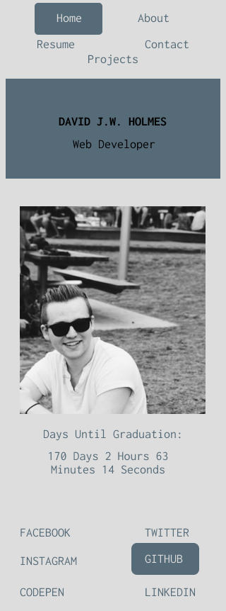
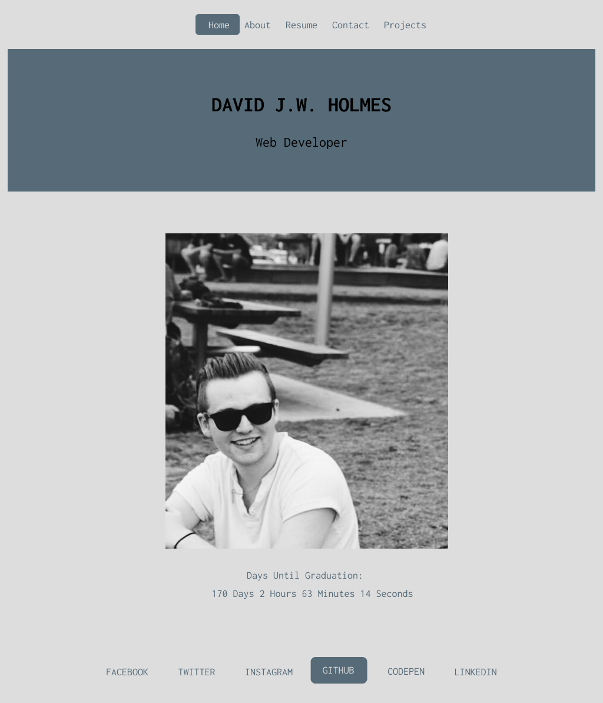

# WEB PORTFOLIO DESIGN
#### www.davidjwholmes.com

---
## Contents
- Target Audience
- Inspiration
- Wireframe
- Changes / Improvements
- Challenges
- Finish product
---

## Target Audience
The target audience for this website is potential employers or clients, who may be viewing it from either a mobile or desktop device.

Therefore, some key principles to adhere to when designing the site were:
 - Ease of use
- Responsive Design
- Effective communication of relevant information to the user
---

## Inspiration
I knew right away that I wanted the site to be quite minimalistic, and that I would go with one of three different designs.
The first idea was for a single parallax scroll page.
The second idea was for a single page with buttons that expanded into whole page sections.
The third idea was to create a single page application that functioned similarly to 
my instructor's own website: ruegen.com.au

I ended up deciding to go with the third design by rolling a dice.

---

## Wireframe

I used the web application Figma to create the wireframes.

>*Mobile version* 

>*Desktop version*

### Colours
The colour palette for the website was randomly generated from Coolors
and can be found at https://coolors.co/000000-b3aca7-566b78-e2dedb-726659
##### Hex values
- Black : #000000
- Silver Chalice: #B3ACA7
- Payne's Grey: #566B78
- Gainsboro: #E2DEDB
- Granite Grey: #726659

### Fonts

The fonts I used were *Inconsolata* (monospaced) and *Lato* (san serif).

---

## Changes and Challenges

Changing the design from the original wireframe brought up some challenges.
Some of these made throughout the creation of the product include:
- Deploying to Netlify
- Getting the contact form (handled by Netlify) to reach my inbox
- Changing the look of the contact form multiple times to get it right.
- Adding shadows to the navigation menu buttons.
- Originally each page was going to have its own colour scheme, but I have decided against that for now.
- Ensuring all the metatags were correct
- Adding the favicon
- Adding a Javascript countdown timer on the home page.
- Making all external links open in a new tab.
- Rewriting the About Me section over and over again.
- VMWare issue caused me to lose large sections of work - Backup Everything!

---

## Things to Improve

- Add a direct link to GitHub project on the projects page
- Thoroughly comment my code for future reference
- Run code through validation software and tidy it up
- Add icons to the bottom navigation links
- Create and add a logo to the top navigation menu
- Create a more interesting favicon
- More favicon size options
- Add sitemap and robot.txt
- Experiment with more colour palettes and complementary font types
- Check if graduation date is correct
- Update resume with more fields
- Add a Personal section to show off personality - interests, photography, blog etc.

---

## Technologies Used
By no means an exhaustive list, but some of the technologies I used for this project are:
- Github
- Figma
- Google Drive
- Google Chrome
- GMail
- VSCode
- VMWare for Windows - Running High Sierra 10.13
- HTML / CSS / JS
- Pinterest
- Dillinger.io
- Codepen.io
- W3Schools.com
- Netlify.com
- Namecheap.com
- Coolors.co

---
## Final thoughts

Overall I am extremely happy with the results of this project. This is the first real website I have created and I've had a lot of fun doing so. I will of course be maintaining it and making improvements throughout the rest of the course where I see fit.

Thank you to the Coder Academy team. You guys rock!

The "finished" product can be found at:
https://www.davidjwholmes.com